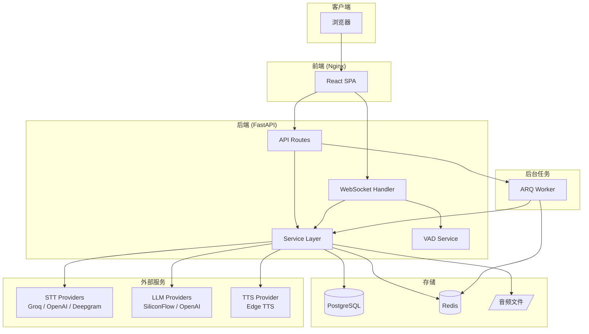
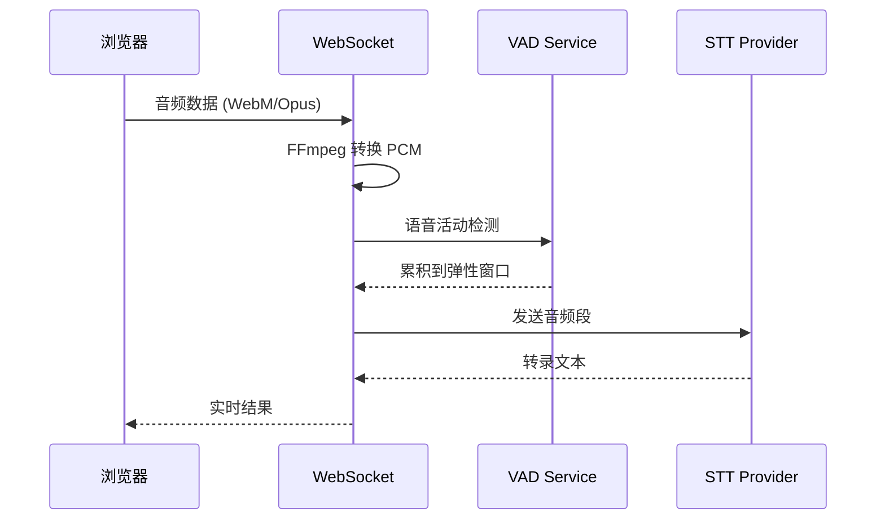
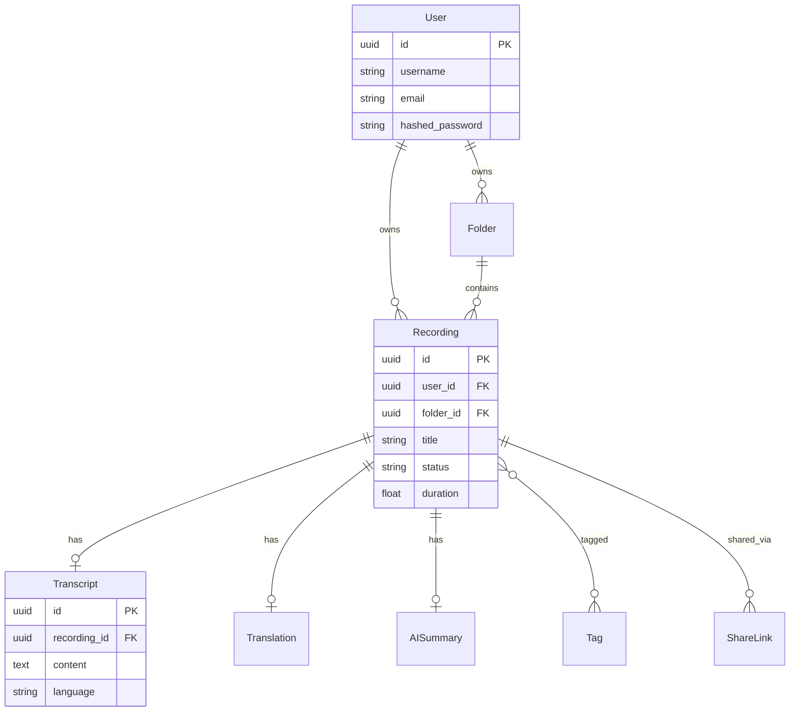

# 架构设计

本文档介绍 EchoText 的系统架构和技术选型。

## 🏗️ 系统架构图



---

## 📦 核心服务职责

| 服务 | 文件 | 职责 |
|------|------|------|
| **STT Service** | `stt_service.py` | 语音转文字，支持多 Provider |
| **LLM Service** | `llm_service.py` | 翻译、摘要、润色 |
| **TTS Service** | `tts_service.py` | 文字转语音 |
| **VAD Service** | `vad_service.py` | 语音活动检测（Silero VAD） |
| **Export Service** | `export_service.py` | 导出 TXT/SRT/JSON |
| **Diarization Service** | `diarization_service.py` | 说话人分离 |

### WebSocket 模块

```
services/websocket/
├── connection_manager.py  # 连接管理
├── session.py             # 会话状态
├── audio_saver.py         # 音频保存
└── translation_handler.py # 实时翻译
```

---

## 🔄 数据流

### 实时转录流程



### 弹性窗口机制

- **最小缓冲**: 3 秒（避免 API 限速）
- **最大缓冲**: 用户配置（默认 6 秒）
- **触发条件**: 静音检测 或 达到最大缓冲

---

## 🛠️ 技术选型理由

### 后端：FastAPI

| 特性 | 原因 |
|------|------|
| 异步支持 | WebSocket + 外部 API 调用需要高并发 |
| 类型提示 | Pydantic 自动验证，减少 bug |
| OpenAPI | 自动生成 API 文档 |

### 任务队列：ARQ

| 对比 Celery | 选择 ARQ 原因 |
|-------------|---------------|
| 依赖较重 | ARQ 轻量，纯 asyncio |
| 需要 RabbitMQ | ARQ 只需 Redis |
| 配置复杂 | ARQ 配置简洁 |

### 前端：React + Zustand

| 特性 | 原因 |
|------|------|
| Zustand vs Redux | 更简洁，无 boilerplate |
| TailwindCSS | 快速开发，utility-first |
| Vite | 极快的 HMR，开发体验好 |

### STT Provider 选择

| Provider | 优势 | 劣势 |
|----------|------|------|
| **Groq** (默认) | 免费额度大，速度快 | 限速 |
| OpenAI | 准确度高 | 价格较高 |
| Deepgram | 真实时流式 | 需付费 |

---

## 📊 数据模型



---

## 🔐 安全架构

```
浏览器 <--HTTPS--> Nginx <--HTTP--> FastAPI
                     |
                     +--> JWT 验证
                     +--> CORS 检查
                     +--> Rate Limiting (TODO)
```

### 认证流程

1. 用户登录 → 获得 Access Token (24h) + Refresh Token (7d)
2. 请求携带 `Authorization: Bearer <token>`
3. Token 过期 → 使用 Refresh Token 换新

### API Key 存储

- 用户配置的第三方 API Key 加密存储于数据库
- 仅用于该用户的 API 调用，不外传

---

## 📁 目录结构

```
echo_text/
├── backend/
│   ├── app/
│   │   ├── api/v1/          # API 路由
│   │   │   ├── auth.py      # 认证
│   │   │   ├── recordings.py # 录音 CRUD
│   │   │   ├── ws_v2.py     # WebSocket 转录
│   │   │   └── ...
│   │   ├── core/            # 核心模块
│   │   │   ├── config.py    # 配置管理
│   │   │   ├── security.py  # JWT/密码
│   │   │   ├── exceptions.py # 自定义异常
│   │   │   └── ...
│   │   ├── models/          # SQLAlchemy 模型
│   │   ├── schemas/         # Pydantic 模式
│   │   ├── services/        # 业务逻辑
│   │   └── workers/         # ARQ 任务
│   ├── tests/               # pytest 测试
│   └── migrations/          # Alembic 迁移
├── frontend/
│   └── src/
│       ├── pages/           # 页面组件
│       ├── components/      # 通用组件
│       ├── hooks/           # 自定义 Hooks
│       ├── stores/          # Zustand 状态
│       └── api/             # API 客户端
└── docs/                    # 文档
```
